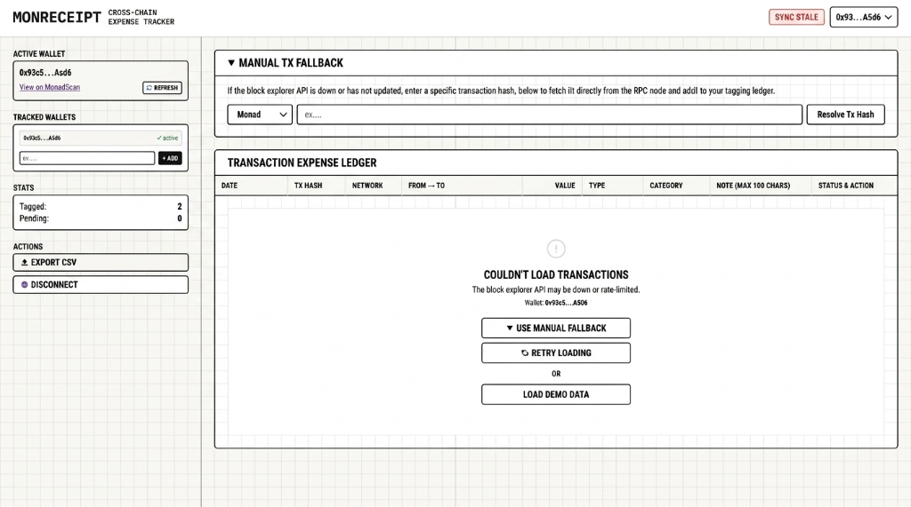
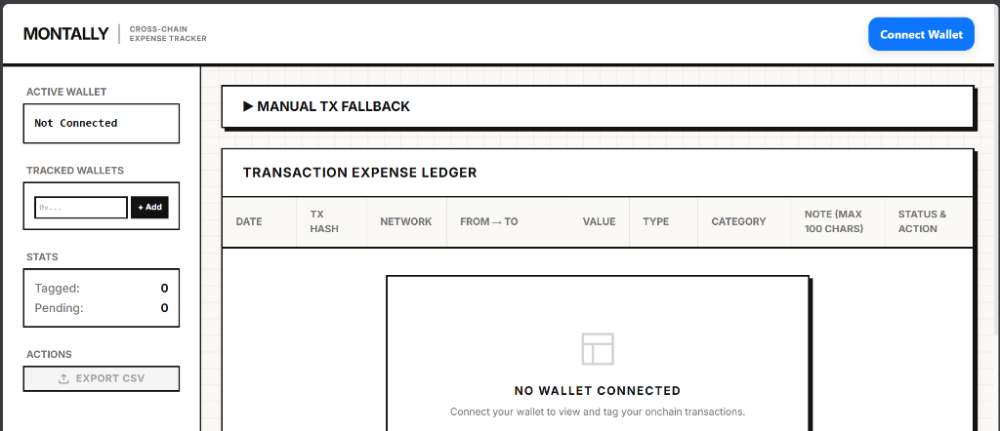

# MonTally

**Cross-Chain Expense Tracker & Onchain Metadata Tagger**

MonTally fetches onchain transactions from Ethereum, Base, and Monad, enables instant categorization and custom accounting notes, and writes those metadata tags **directly onchain** using Monad as an ultra-cheap, high-speed storage layer.

[](https://montally-io.vercel.app)
[](https://explorer.monad.xyz/address/0xCA79519f744dC0DAaCcAA88e85E8E85FfbE838C3)
[](https://x.com/SYther069)
[](https://github.com/syther069/MonTally)

---

## Visual Previews

### Landing Page (Swiss Onchain Minimal Theme)


### Transaction Expense Ledger & Onchain Tagging


---

## Why Built? (Problem & Solution)

### The Problem
During tax season, onchain accounting is broken. Block explorers (Etherscan, BaseScan, MonadScan) show raw addresses and values, but provide zero contextual intent. Accountants cannot determine whether a transfer was a token swap, a business expense, an investment, or a personal reimbursement. Users are forced to copy hashes into private spreadsheets, take screenshots, or write manual notes that eventually get lost.

### The Gas Dilemma
Storing expense metadata directly on Ethereum L1 or standard L2s costs **$1.00 to $5.00** per transaction write due to gas volatility. No user will pay L1/L2 gas fees just to store bookkeeping notes.

### The Solution
MonTally uses **Monad** as a unified metadata storage registry. Because Monad fees are sub-penny (less than `$0.001` per write), users can store permanent, censorship-resistant notes onchain for their entire multichain activity at virtually zero cost.

---

## System Architecture

```
                 +-------------------+
                 |   React Frontend  |
                 +---------+---------+
                           |
            +--------------+--------------+
            |                             |
            v                             v
  +------------------+          +------------------+
  |  Etherscan/Base  |          |  Monad Contract  |
  |  API History     |          |  (TagRegistry)   |
  |                  |          |                  |
  | Fetch tx lists   |          | Store/Read tags  |
  | (L1 / L2 history)|          | (Metadata tags)  |
  +------------------+          +------------------+
```

1. **Transaction Retrieval:** The frontend queries Block Explorer APIs (BaseScan, MonadScan) to aggregate raw multichain transaction histories into a single ledger.
2. **RPC Fallback:** If explorer APIs prune or lag on new transactions, MonTally queries JSON-RPC nodes directly to resolve raw transaction hashes.
3. **Onchain Tag Storage:** When a user saves a tag, it calls `addTag` or `updateTag` on the `TagRegistry` contract on Monad. The contract records the original transaction hash, chain ID, category, note, and timestamp.
4. **CSV Export:** The frontend merges raw transaction data with onchain tags and exports a clean, accountant-ready CSV spreadsheet.

---

## Smart Contract (`TagRegistry.sol`)

Deploys on Monad to store user-indexed transaction metadata permanently onchain:

```solidity
// SPDX-License-Identifier: MIT
pragma solidity ^0.8.20;

contract TagRegistry {
    struct Tag {
        string txHash;
        uint256 chainId;
        string category;
        string note;
        uint256 timestamp;
        bool exists;
    }

    // Owner address mapping to their tagged transaction hashes
    mapping(address => mapping(string => Tag)) private userTags;
    // Track tagged transaction hashes list per user
    mapping(address => string[]) private userTxHashes;

    event TagAdded(address indexed user, string txHash, uint256 chainId, string category, string note);
    event TagUpdated(address indexed user, string txHash, uint256 chainId, string category, string note);

    function addTag(string calldata _txHash, uint256 _chainId, string calldata _category, string calldata _note) external {
        require(!userTags[msg.sender][_txHash].exists, "Tag already exists");
        
        userTags[msg.sender][_txHash] = Tag({
            txHash: _txHash,
            chainId: _chainId,
            category: _category,
            note: _note,
            timestamp: block.timestamp,
            exists: true
        });
        
        userTxHashes[msg.sender].push(_txHash);
        emit TagAdded(msg.sender, _txHash, _chainId, _category, _note);
    }

    function updateTag(string calldata _txHash, uint256 _chainId, string calldata _category, string calldata _note) external {
        require(userTags[msg.sender][_txHash].exists, "Tag does not exist");
        
        Tag storage tag = userTags[msg.sender][_txHash];
        tag.category = _category;
        tag.note = _note;
        tag.timestamp = block.timestamp;
        tag.chainId = _chainId;
        
        emit TagUpdated(msg.sender, _txHash, _chainId, _category, _note);
    }

    function getTag(address _user, string calldata _txHash) external view returns (Tag memory) {
        return userTags[_user][_txHash];
    }

    function getUserTags(address _user) external view returns (Tag[] memory) {
        string[] memory hashes = userTxHashes[_user];
        Tag[] memory tags = new Tag[](hashes.length);
        for (uint256 i = 0; i < hashes.length; i++) {
            tags[i] = userTags[_user][hashes[i]];
        }
        return tags;
    }
}
```

- **Deployed Contract Address (Monad Testnet):** `0xCA79519f744dC0DAaCcAA88e85E8E85FfbE838C3`

---

## Core Features & Workflow

- **Manual Fallback Accordion (`▶ Manual Tx Fallback`):** If an explorer API lags on a brand-new transaction hash, paste the hash directly into the collapsible manual fallback input to fetch it straight from the JSON-RPC node.
- **Tagged Transactions View & Category Filtering:** Instantly isolate tagged expenses or filter by category (`Investment`, `Income`, `Business Expense`, `Personal Expense`, `Donation`, `Swap`). Edit any existing tag in-place and re-submit to Monad.
- **Accurate Wallet Identifiers:** Active wallet addresses render with a high-contrast **You** badge and display copy/explorer actions on hover.
- **Accountant CSV Export:** Download structured spreadsheets merging raw transaction metrics with custom onchain tags in a single click.

---

## Setup & Local Development

### 1. Smart Contracts (`/contracts`)
Requires Node.js and Hardhat.

```bash
cd contracts
npm install

# Create environment file
echo 'MAINNET_PRIVATE_KEY="0x_your_private_key_here"' > .env

# Compile contracts
npx hardhat compile

# Deploy to Monad
npx hardhat run scripts/deploy.ts --network monadMainnet
```

### 2. Frontend Application (`/frontend`)
Requires Node.js (v18+) and npm.

```bash
cd frontend
npm install

# Create environment file
echo 'VITE_CONTRACT_ADDRESS="0xCA79519f744dC0DAaCcAA88e85E8E85FfbE838C3"' > .env

# Run development server
npm run dev
```

Open `http://localhost:5173` in your browser.

---

## Links & Community

- **Live Application:** [montally-io.vercel.app](https://montally-io.vercel.app)
- **X (Twitter):** [@SYther069](https://x.com/SYther069)
- **GitHub Repository:** [syther069/MonTally](https://github.com/syther069/MonTally)
- **Monad Contract:** [`0xCA79519f744dC0DAaCcAA88e85E8E85FfbE838C3`](https://explorer.monad.xyz/address/0xCA79519f744dC0DAaCcAA88e85E8E85FfbE838C3)

---

## License
MIT License
